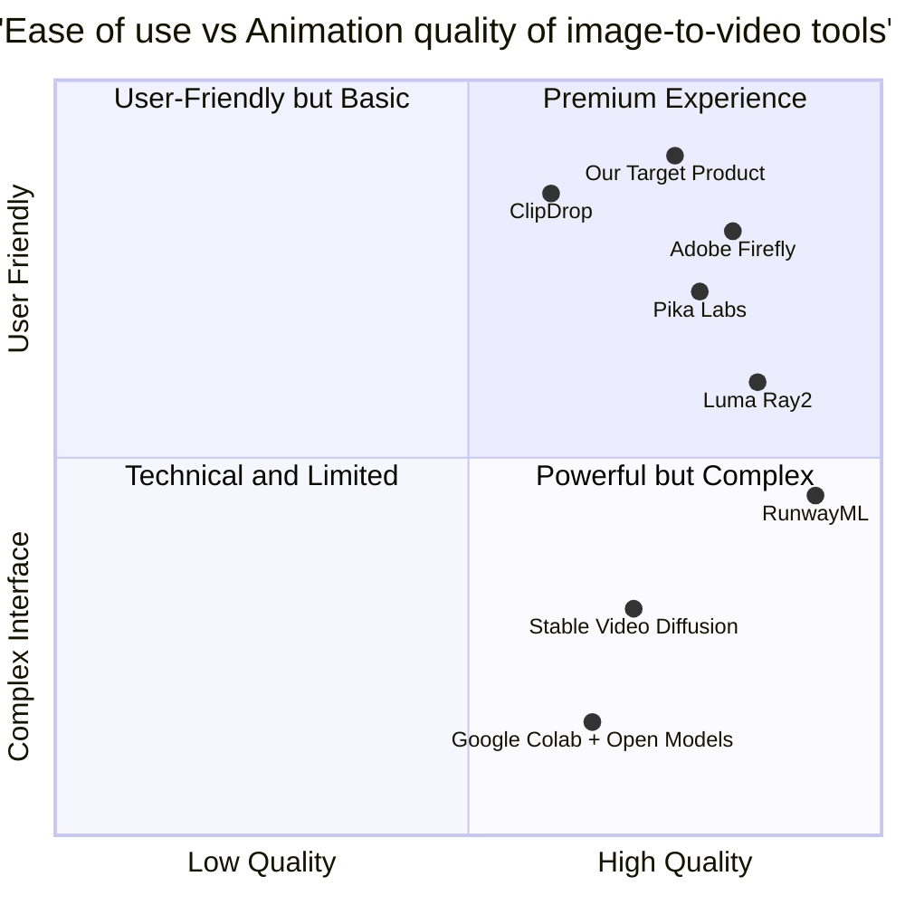

# Product Requirements Document (PRD)

## AI-Powered Image-to-Video Animation Web Application

**Date:** June 4, 2025  
**Version:** 1.0  
**Project Name:** animate_ai  

## Original Requirements
Create an app to convert images to videos using AI, animate the image, with the option to use DeepSeek or other free AI tools. The application should be able to utilize Google Colab or a free API.

## 1. Product Definition

### 1.1 Product Goals
- Create a user-friendly web application that converts static images into animated videos using AI technology
- Provide high-quality animations with various style options while maintaining zero cost to users
- Build a platform that can scale by integrating multiple free AI services to improve reliability and feature diversity

### 1.2 User Stories
1. As a content creator, I want to upload my still images and convert them into short animated videos so that I can engage my audience with more dynamic content.
2. As a social media manager, I want to select different animation styles for my product images so that I can create unique promotional content quickly.
3. As a teacher, I want to animate educational diagrams so that I can better explain complex concepts to my students.
4. As a non-technical user, I want a simple interface to bring my family photos to life so that I can share nostalgic moments in a new way.
5. As a digital artist, I want to see my artwork in motion so that I can expand my portfolio with minimal additional effort.

### 1.3 Competitive Analysis

| Product | Pros | Cons |
|---------|------|------|
| **Pika Labs** | - High-quality animations - Both Discord bot and web app access - Multiple animation styles | - Limited free generations - Short video duration (3-5 seconds) - Advanced features require payment |
| **RunwayML Gen-4** | - Professional-grade quality - Good for cinematic effects - Various editing tools | - Strict free tier limitations - Watermark on free outputs - Complex UI for beginners |
| **Adobe Firefly Video** | - IP-friendly content - Integration with Adobe suite - Commercially safe animations | - Only 2 free generations - Requires account creation - Limited customization options |
| **Stable Video Diffusion** | - Open-source foundation - Good community support - Colab notebook availability | - Technical knowledge required - Inconsistent results - Limited motion control |
| **ClipDrop** | - Simple interface - Multiple image tools included - Reasonable free tier | - Basic animation options - Limited resolution options - Limited style variety |
| **Luma Ray2** | - Quality results - Natural motion generation - Good for realistic content | - Limited free access - Longer processing time - Less control over animation |
| **Google Colab + Open Models** | - Completely free (with limitations) - Customizable workflows - No generation limits | - Significant technical knowledge required - Setup complexity - Variable processing time |

### 1.4 Competitive Quadrant Chart

## 2. Technical Specifications

### 2.1 Requirements Analysis

The application must provide a seamless web-based experience for users to convert static images to animated videos. The system should leverage free AI services through API integration or Google Colab backend processing to keep costs minimal. Performance considerations must balance user experience with the limitations of free-tier services.

**Core System Components:**

1. **Frontend Interface**:
   - Responsive web design for desktop and mobile devices
   - Drag-and-drop image upload capability
   - Simple, intuitive controls for animation parameters
   - Real-time preview capabilities where possible

2. **Backend Processing**:
   - Image processing and preparation pipeline
   - AI service integration layer
   - Video generation queue management
   - Temporary file storage system

3. **AI Service Integration**:
   - Primary AI model selection and integration
   - Fallback service options for reliability
   - Google Colab notebook execution capability

4. **Output Delivery**:
   - Video compression and optimization
   - Download options (MP4, GIF, WebM)
   - Optional sharing capabilities

### 2.2 Requirements Pool

#### P0 (Must Have)
- Users MUST be able to upload images in common formats (JPG, PNG, WebP)
- System MUST integrate with at least one free AI image-to-video service
- Users MUST be able to download their animated videos
- System MUST handle errors gracefully when AI services fail
- Application MUST work on modern web browsers (Chrome, Firefox, Safari, Edge)
- System MUST respect usage limits of free AI services

#### P1 (Should Have)
- Users SHOULD be able to select from multiple animation styles
- System SHOULD provide video preview before download
- Users SHOULD be able to adjust basic parameters (duration, motion intensity)
- System SHOULD have fallback options when primary AI service is unavailable
- Application SHOULD provide feedback on processing status
- Users SHOULD be able to crop/adjust their image before processing

#### P2 (Nice to Have)
- Users MAY have accounts to save their creations
- System MAY offer multiple resolution options
- Users MAY be able to add simple text overlays
- System MAY integrate with multiple AI services for comparison
- Application MAY provide one-click sharing to social media
- Users MAY be able to schedule batch processing for multiple images

### 2.3 UI Design Draft

**Main Screen Layout:**

1. **Header Section**:
   - Logo and application name
   - Navigation menu (Home, Gallery, About, Help)

2. **Upload Section**:
   - Large drop zone for image upload
   - File browser button
   - Supported format information

3. **Options Panel**:
   - AI model selection dropdown
   - Animation style selection with thumbnails
   - Basic parameters (sliders for duration, intensity)
   - Advanced options toggle (expandable)

4. **Preview Section**:
   - Original image display
   - Animation preview window
   - Processing status indicator

5. **Action Buttons**:
   - "Generate Animation" primary button
   - Download options (format selection)
   - Share options

6. **Footer**:
   - Processing credits/limits information
   - Links to terms and privacy policy

### 2.4 Implementation Approach

#### Frontend Implementation
- React framework for the user interface
- Tailwind CSS for responsive design
- Simple state management with React hooks

#### Backend Implementation Options

**Option 1: Serverless Architecture**
- AWS Lambda or similar serverless function
- API Gateway for frontend communication
- S3 or similar for temporary file storage
- Integration with AI APIs directly

**Option 2: Google Colab Integration**
- Node.js Express server as API intermediary
- Python scripts to execute Colab notebooks
- Webhook system for status updates
- Temporary file storage with cloud bucket

**Option 3: Hybrid Approach**
- Light server for user requests and file handling
- Distribute processing across multiple free AI services
- Fallback to Colab for advanced features

#### API Integration Strategy

1. **Primary Integration: Stable Video Diffusion**
   - Open-source model compatible with Colab
   - Can be run without usage limitations
   - Basic animation capabilities

2. **Secondary Integrations:**
   - Pika Labs API for higher quality (with free tier limits)
   - ClipDrop for alternative style options
   - Custom Colab notebooks for specialized animations

3. **Fallback Strategy:**
   - Implement queue system for rate limited services
   - Rotate between services to maximize free tier usage
   - Transparent communication to users about processing times

### 2.5 Open Questions

1. **Performance Optimization**
   - How can we optimize image processing to reduce AI service computation time?
   - What pre-processing techniques can improve animation quality?

2. **Service Reliability**
   - How will the system handle changes to free tier limitations of AI services?
   - What is the backup plan if Google Colab restricts automated notebook execution?

3. **User Experience**
   - What is an acceptable waiting time for users during video generation?
   - Should we implement a notification system for longer processing jobs?

4. **Scaling Considerations**
   - How can the platform scale if user demand exceeds free tier capacities?
   - What monetization options might be suitable if free resources become limited?

5. **Integration Updates**
   - How frequently will we need to update Colab notebook integrations as models improve?
   - What is the process for evaluating and integrating new AI animation services?

## 3. Technical Feasibility Assessment

### 3.1 Google Colab Integration

Google Colab offers a viable path for implementing the backend processing required for image-to-video conversion:

**Implementation Approach:**
- Create a stable Colab notebook implementing Stable Diffusion for video generation
- Develop a system to programmatically execute the notebook with user parameters
- Implement file transfer between web application and Colab environment

**Limitations:**
- Free tier restrictions (GPU time limits, disconnection after inactivity)
- Processing queue may be necessary during high demand
- Video quality and length constraints based on free GPU resources

### 3.2 Free API Options

**Available Free Options:**

1. **Stable Video Diffusion API:**
   - Open-source model accessible via Hugging Face
   - No direct usage limits, but requires computing resources
   - Basic animation capabilities with reasonable quality

2. **Limited Free-Tier APIs:**
   - Runway Gen-4 (limited generations)
   - Pika Labs API (limited generations)
   - ClipDrop API (daily restrictions)

3. **Custom API Implementation:**
   - Self-hosted open-source models via containerized services
   - Free except for hosting costs
   - Requires technical expertise to maintain

### 3.3 Recommended Technical Architecture

Based on the evaluation of free resources, a hybrid architecture is recommended:

1. **Web Frontend:**
   - React + Tailwind CSS for responsive interface
   - Client-side image preparation and validation
   - Progress tracking and notification system

2. **Backend Service Layer:**
   - Lightweight Node.js service for coordination
   - API integration manager for multiple services
   - Queue system for processing requests

3. **Processing Options:**
   - Primary: Direct API integration with free services
   - Secondary: Google Colab notebook execution
   - Fallback: Simplified animation options with client-side processing

4. **Storage and Delivery:**
   - Temporary cloud storage for in-process files
   - Client-side download to avoid hosting costs
   - Optional: Integration with free video hosting services

## 4. Development Roadmap

### Phase 1: MVP (Minimum Viable Product)
- Basic web interface with image upload functionality
- Integration with one primary free AI service
- Simple animation parameters
- Download capability for generated videos

### Phase 2: Enhanced Features
- Multiple AI service integrations
- Advanced animation controls
- Google Colab fallback implementation
- Improved UI with preview capabilities

### Phase 3: Optimization and Scale
- Service rotation to maximize free tier usage
- User accounts for saved preferences
- Batch processing capabilities
- Mobile optimization

## 5. Conclusion

The AnimateAI web application is technically feasible using free resources, though careful planning is required to manage the limitations of free services. By implementing a hybrid approach that leverages multiple free AI services and Google Colab integration, we can provide users with a quality image-to-video animation experience without direct costs. The system architecture must be designed with flexibility to adapt to changes in free service offerings and potential scaling requirements in the future.

This project balances user experience with technical constraints to deliver a valuable tool for converting static images to engaging animated videos using the latest AI technology.